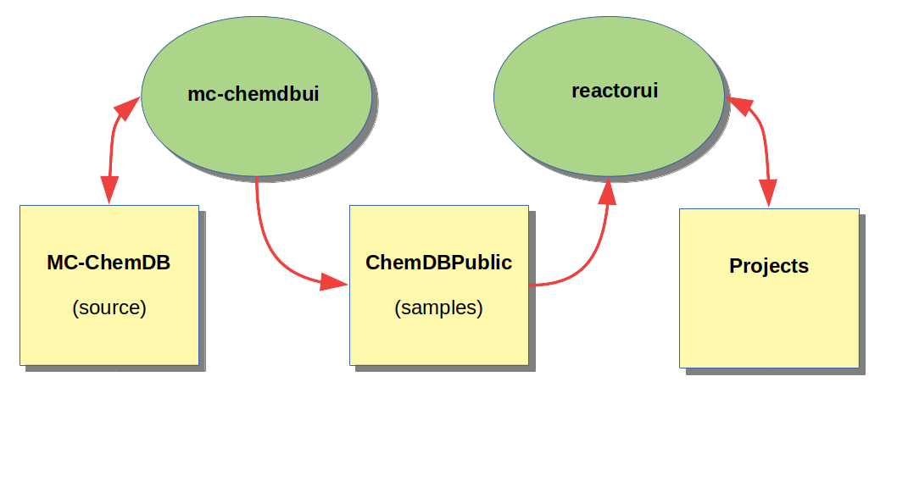

MC-ChemDBUI User's Manual
=========================
(2022-09-12)

## Introduction

The `mc-chemdbui` graphical interface enables to manage the `MC-ChemDB` database
and to generate random samples in `ChemDBPublic` for use in `reactor`.

### Installation

1. Load the latest release of `MC-ChemDB` from the GitHub repository https://github.com/ppernot/MC-ChemDB
and unpack it 

2. If it does not exist, create a `ChemDBPublic` directory 

3. Download the latest docker container for `mc-chemdbui` from DockerHub
   `docker pull ppernot1/mc-chemdbui`
   
3. Run the docker container with source links for MC-ChemDB and ChemDBPublic 
pointing to *your* directories `docker run -d -p 3820:3820 --mount type=bind,source="$(pwd)"/../ChemDBPublic,target=/ChemDBPublic --mount type=bind,source="$(pwd)"/../MC-ChemDB,target=/MC-ChemDB --name mc-chemdbui ppernot1/mc-chemdbui`

### Usage

The interface is organized in three panels related to the main databases:

  - [__Neutrals__](1-neutrals.html): manage reactions between neutral species

  - [__Ions__](2-ions.html): manage reactions involving ions

  - [__Photoprocesses__](3-photo.html): TBD
  
Their functionnalities are uniformly accessed through a menu with the 
'Files', 'Edit', 'Sample', and 'Report` items.

### Curation

If you make changes to the source databases, they will affect your *local* copy only. 
When these changes are of interest to the community, you have to save them
also on GitHub, for instance by creating a fork of the main branch of 
`MC-ChemDB` (see https://github.com/ppernot/MC-ChemDB).

### References

A good introduction to the data and methods can be found in the article

* Z. Peng, N. Carrasco and P. Pernot (2014) "Modeling of synchrotron-based laboratory simulations of Titan's ionospheric photochemistry", _GeoResJ_ __1-2__:33–53. http://dx.doi.org/10.1016/j.grj.2014.03.002

